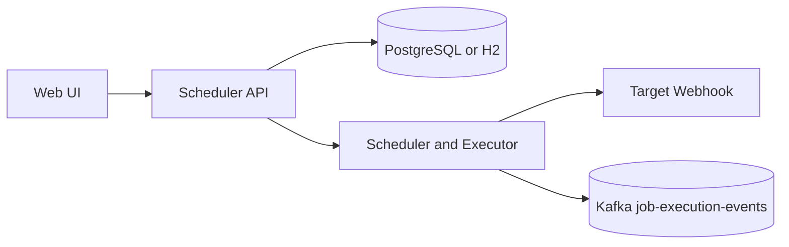

# Microservices Architecture Roadmap

## Current architecture

The repository currently runs as a modular Spring Boot application. This is intentional:
local development remains simple, while the internal boundaries are ready for service
extraction.



The scheduler owns job definitions, cron registration, execution retries, and the audit
record. `JobEventPublisher` isolates event delivery from the scheduling domain, and the
Kafka implementation is already optional through `app.kafka.enabled`.

## Recommended service boundaries

### 1. Scheduler API service

Responsibilities:

- Authenticate users and authorize job operations
- Create, update, enable, disable, and delete jobs
- Store job definitions
- Register schedules and issue manual-run commands
- Publish job execution events

Data ownership: `scheduled_jobs` and the API-facing job configuration.

### 2. Execution worker service

Responsibilities:

- Consume execution commands from Kafka
- Call target webhooks with timeout and retry policies
- Record execution results
- Publish `JobExecutionCompleted` events

Data ownership: execution records and retry state. The worker must not query the
scheduler service's tables directly; it communicates through events or an API contract.

### 3. Audit and notification service

Responsibilities:

- Consume completed execution events
- Store an append-only audit history
- Publish operational notifications for repeated failures
- Expose reporting endpoints or dashboards

This service is a good second extraction because it is read-heavy and does not need to
participate in the scheduler's transaction.

## Event contract

The current `JobEvent` is the first version of the integration contract:

```json
{
  "jobId": 42,
  "jobName": "customer-sync",
  "status": "SUCCESS",
  "executedAt": "2026-09-06T10:30:00"
}
```

Before extracting a service, evolve this into a versioned event envelope with an event
ID, event type, schema version, occurred-at timestamp, correlation ID, and producer:

```json
{
  "eventId": "uuid",
  "eventType": "JobExecutionCompleted",
  "schemaVersion": 1,
  "correlationId": "request-id",
  "occurredAt": "2026-09-06T10:30:00Z",
  "producer": "scheduler-api",
  "payload": {
    "jobId": 42,
    "status": "SUCCESS",
    "attempts": 1,
    "durationMs": 184
  }
}
```

## Safe extraction sequence

1. Keep the current application as the working baseline.
2. Add a Kafka consumer for execution events inside a separate deployable module.
3. Move webhook execution from `JobService` into the worker only after the event and
   command contracts are tested.
4. Give the worker and scheduler separate databases or schemas.
5. Add idempotency using `eventId` and a consumer offset strategy.
6. Add dead-letter handling, retry backoff, health checks, and metrics.
7. Deploy each service independently with its own security configuration.

## Why not split immediately?

A distributed system introduces network failures, duplicate messages, schema evolution,
independent deployments, tracing, and operational overhead. A modular monolith provides
those boundaries without making the Codespaces demo difficult to run. The project can
therefore demonstrate both sound service decomposition and pragmatic delivery.

## Production concerns to demonstrate

- OAuth2/OIDC at the edge and service-to-service credentials
- TLS for browser, API, and Kafka connections
- Correlation IDs and distributed tracing
- Kafka consumer groups and dead-letter topics
- Idempotent consumers and outbox publishing
- Separate database ownership per service
- Actuator health, metrics, and alerting
